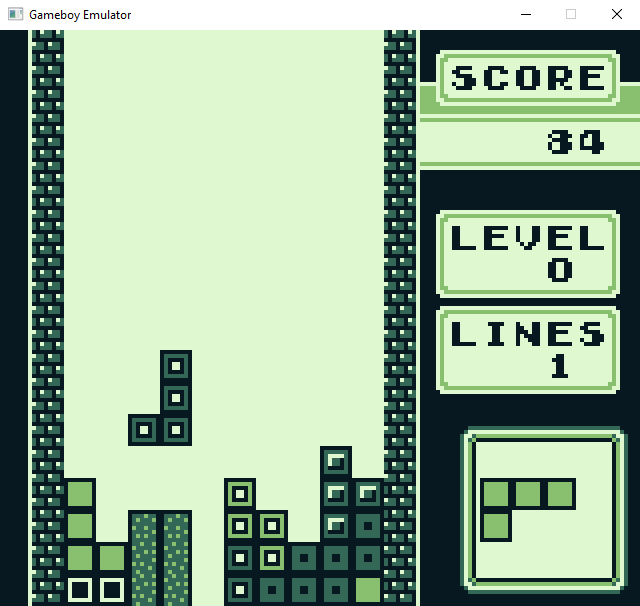
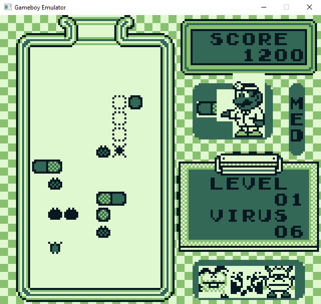

# Rust GameBoy Emulator

A GameBoy emulator implemented in Rust.

One feature I implemented was an automatic cycle-time determination for instructions.
Most GameBoy emulators hard code the number of cycles required for an instruction
to complete execution, which can vary depending on the addressing mode used,
whether a memory access crosses a page boundary, if a branch is taken or not, etc.

It can run Tetris just fine, and Dr. Mario with some graphical issues.

